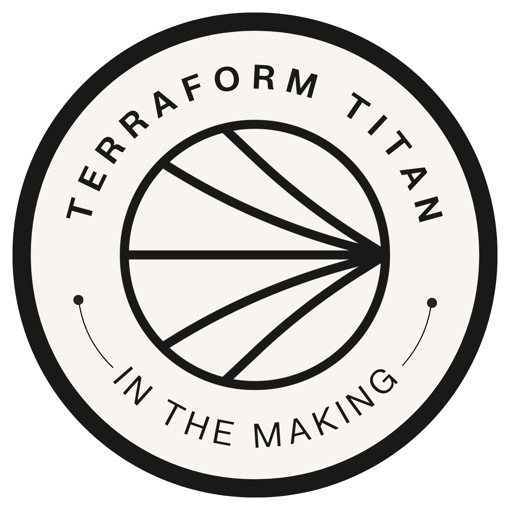

  

# AWS S3 Bucket Automation with Terraform

**Project Link:** http://learn.nextwork.org/projects/aws-devops-terraform1  
**Author:** Shane Brown  
**Email:** shanebrown848@gmail.com  

---

## Overview

This project demonstrates how to provision and manage AWS infrastructure using **Terraform**. The focus is on building and managing an **Amazon S3 bucket** using Infrastructure as Code (IaC), including authentication, planning, deployment, tagging, and object uploads.

The project follows real-world DevOps practices and highlights Terraform’s full workflow from initialization to deployment.

---

## Tech Stack

- Terraform
- Amazon S3
- AWS CLI
- AWS IAM (Access Keys)
- WSL (Kali Linux)

---

## Key Features

- Automated S3 bucket creation using Terraform
- Environment tagging (`Environment = "Dev"`)
- Secure AWS authentication via AWS CLI
- Terraform state management
- Uploaded and managed S3 objects via Terraform
- Verified deployment through Terraform and AWS Console

---

## Terraform Workflow

1. **terraform init**  
   Initializes the project and installs provider plugins.

2. **terraform plan**  
   Generates a preview of infrastructure changes.

3. **terraform apply**  
   Provisions real AWS resources and manages state.

This workflow ensures safe, predictable infrastructure changes.

---

## Configuration Structure

- **Provider Block**  
  Defines AWS as the cloud provider.

- **Resource Block**  
  Creates and configures the S3 bucket.

- **Output Block**  
  Exposes useful deployment details.

The modular structure improves readability, scalability, and maintainability.

---

## AWS Authentication

During planning, Terraform returned:

This was resolved by:
- Installing AWS CLI
- Generating AWS access keys
- Configuring local credentials

Terraform then authenticated successfully and deployed resources.

---

## Extension: Uploading an S3 Object

As an extension, the configuration was updated to upload an object to the S3 bucket. After updating `main.tf`, `terraform apply` was run again to reflect the change.

Validation was performed by:
- Reviewing Terraform apply output
- Confirming the object in the AWS S3 console

---

## Project Reflection

**Duration:** ~2 hours  

**Challenge:**  
Choosing between Windows PowerShell and WSL (Kali Linux). Both required testing and configuration.

**Result:**  
Kali Linux was selected for a smoother Terraform workflow.

**Outcome:**  
A fully automated, reproducible AWS deployment managed entirely through code.

---

## Takeaway

This project reinforced core DevOps and cloud engineering skills, including Infrastructure as Code, Terraform workflows, AWS authentication, and state-driven resource management.

---
